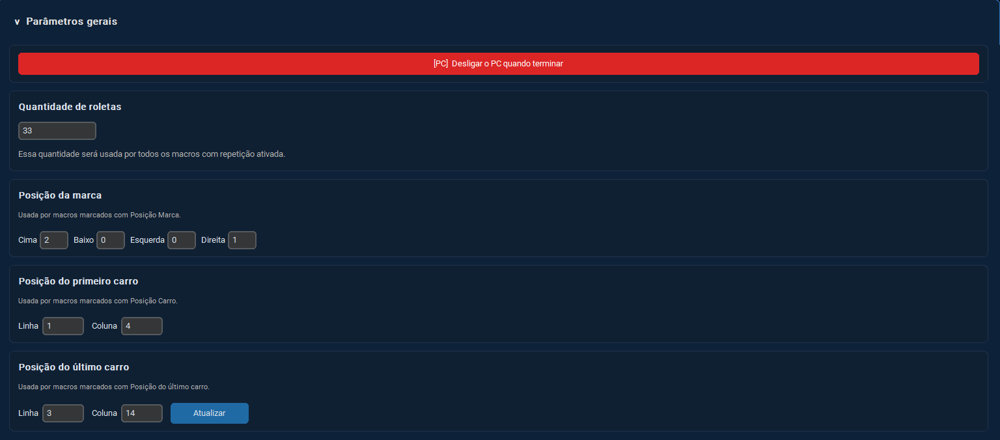

# Manual da Tela - Parâmetros Gerais

## Visão Geral

A tela **Parâmetros Gerais** é responsável pela configuração dos parâmetros utilizados pelas rotinas automáticas do sistema. Os valores definidos nesta tela são compartilhados entre as macros que utilizam estas configurações.



---

# Desligar o PC quando terminar

Permite definir se o computador deverá ser desligado automaticamente após a conclusão da execução da macro ou playlist.

### Funcionamento

- Quando ativado, ao término da execução da rotina o sistema executará o desligamento do computador.
- Quando desativado, o sistema apenas encerrará a execução da rotina.

### Observação

Utilize esta opção com cuidado, principalmente quando houver outros programas ou documentos abertos.

---

# Quantidade de Roletas

Campo utilizado para definir a quantidade total de roletas que serão processadas pelas macros que possuem repetição ativada.

### Exemplo

```text
Quantidade de roletas: 33
```

Neste caso, a macro repetirá o processo até completar 33 roletas.

### Observação

Este valor é utilizado por todas as macros configuradas para trabalhar com repetição automática.

---

# Posição da Marca

Define a posição inicial da marca dentro da grade utilizada pelas macros que dependem de posicionamento.

### Campos

| Campo | Descrição |
|---------|---------|
| Cima | Quantidade de posições acima |
| Baixo | Quantidade de posições abaixo |
| Esquerda | Quantidade de posições à esquerda |
| Direita | Quantidade de posições à direita |

### Exemplo

```text
Cima: 2
Baixo: 0
Esquerda: 0
Direita: 1
```

### Utilização

Esta configuração é utilizada exclusivamente por macros marcadas com a opção **Posição Marca**.

---

# Posição do Primeiro Carro

Define a localização do primeiro carro dentro da grade de veículos.

### Campos

| Campo | Descrição |
|---------|---------|
| Linha | Linha onde está localizado o primeiro carro |
| Coluna | Coluna onde está localizado o primeiro carro |

### Exemplo

```text
Linha: 1
Coluna: 4
```

### Utilização

Esta configuração é utilizada pelas macros marcadas com a opção **Posição Carro**.

---

# Posição do Último Carro

Exibe a posição calculada do último carro considerando:

- A posição inicial do primeiro carro.
- A quantidade de roletas configurada.

### Campos

| Campo | Descrição |
|---------|---------|
| Linha | Linha calculada do último carro |
| Coluna | Coluna calculada do último carro |

### Importante

⚠️ Este campo é **somente leitura**.

O usuário não pode alterar estes valores manualmente.

A posição é calculada automaticamente pelo sistema com base em:

```text
Posição do Primeiro Carro
+
Quantidade de Roletas
```

### Atualização do Cálculo

O cálculo da posição do último carro é realizado quando:

- O usuário clicar no botão **Atualizar**.
- Uma rotina ou playlist for executada.

### Exemplo

Configuração:

```text
Quantidade de Roletas: 33
Primeiro Carro:
    Linha: 1
    Coluna: 4
```

Resultado calculado:

```text
Último Carro:
    Linha: 3
    Coluna: 14
```

---

# Botão Atualizar

O botão **Atualizar** recalcula a posição do último carro utilizando os valores atualmente informados.

### Quando utilizar

Recomenda-se clicar em **Atualizar** sempre que:

- Alterar a quantidade de roletas.
- Alterar a posição do primeiro carro.

Dessa forma o sistema exibirá imediatamente a nova posição calculada do último carro.

---

# Fluxo Recomendado

1. Definir a quantidade de roletas.
2. Informar a posição da marca (se necessário).
3. Informar a posição do primeiro carro.
4. Clicar em **Atualizar**.
5. Conferir a posição calculada do último carro.
6. Executar a rotina ou playlist.

---

# Observações Gerais

- Todas as configurações são compartilhadas pelas macros que utilizam estes parâmetros.
- A posição do último carro não pode ser editada manualmente.
- O cálculo da posição do último carro será atualizado automaticamente durante a execução das rotinas.
- Recomenda-se validar as posições antes de iniciar uma execução longa.
